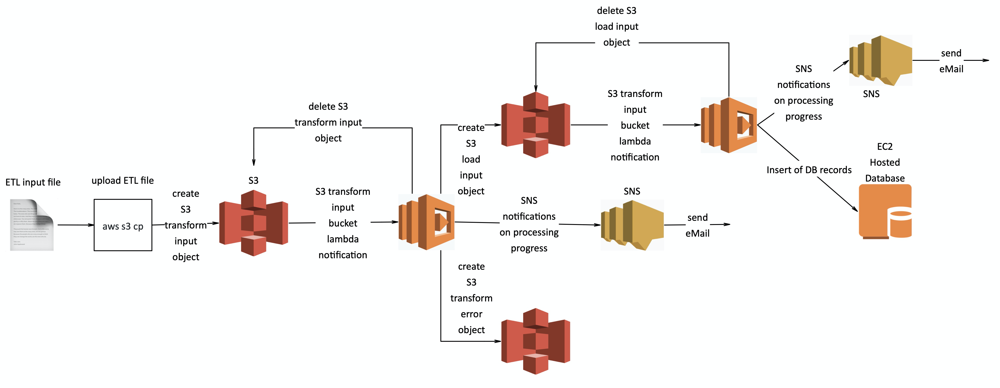
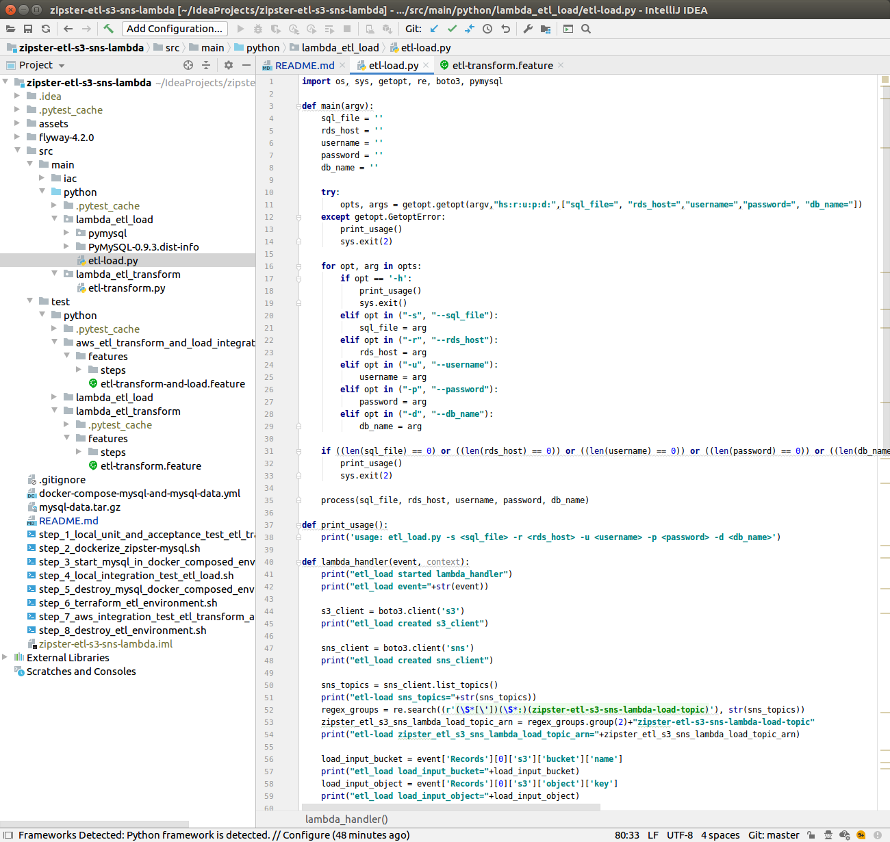
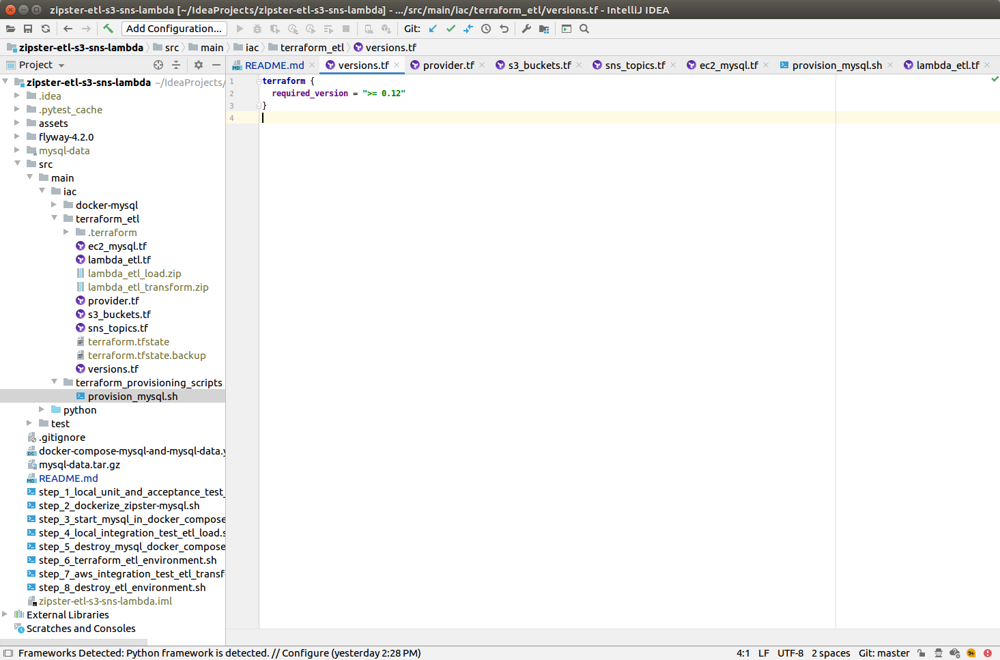
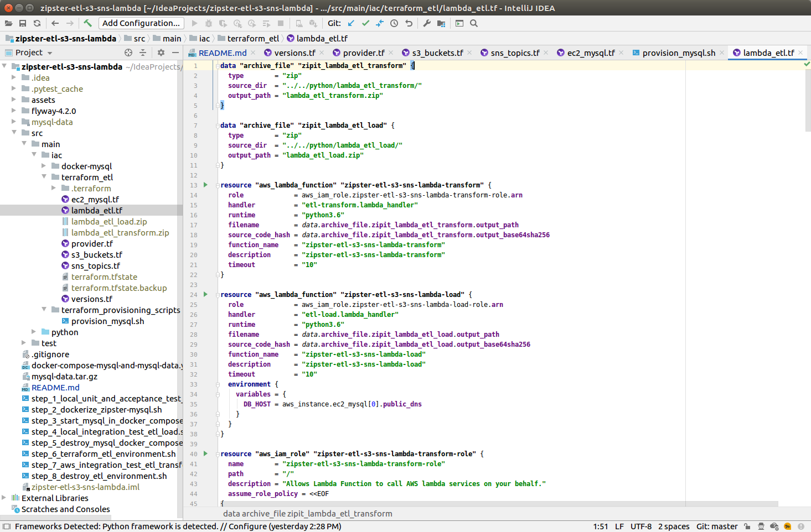
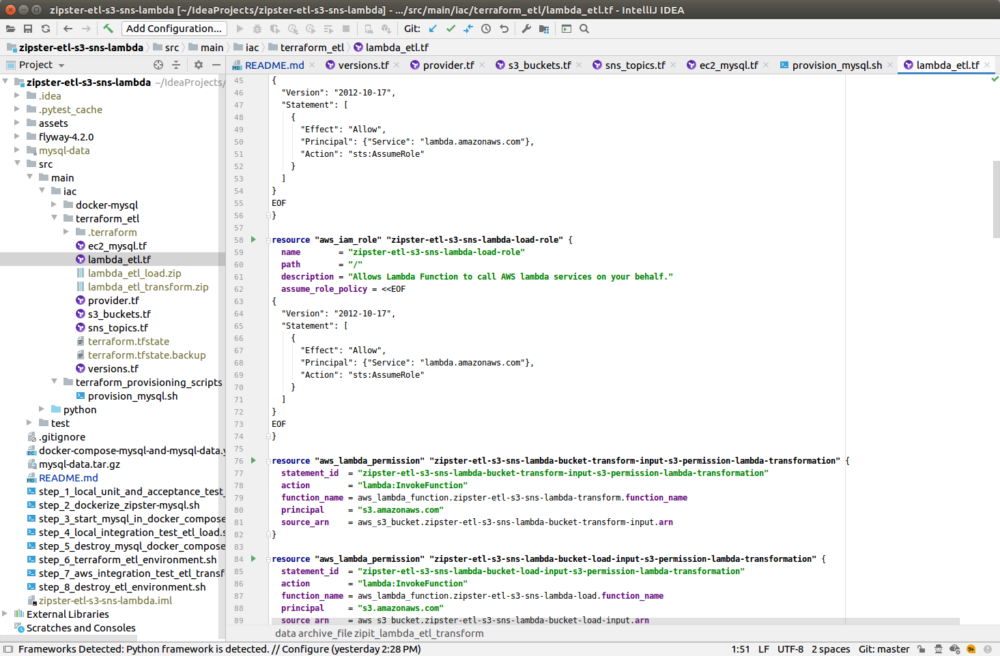
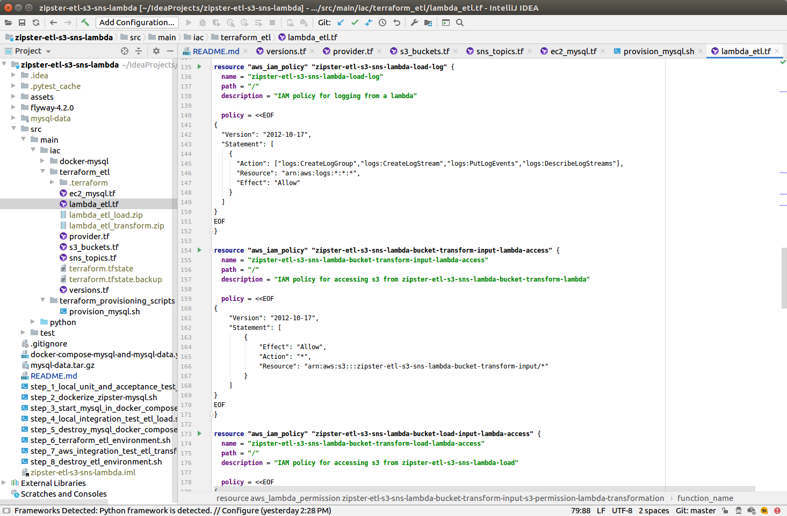
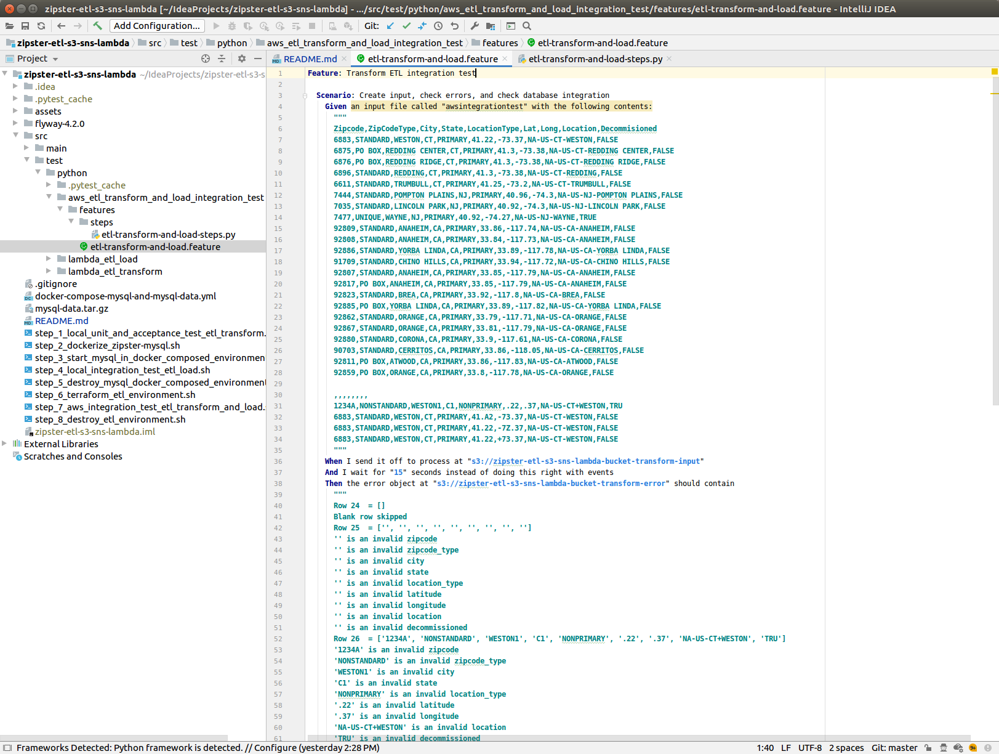
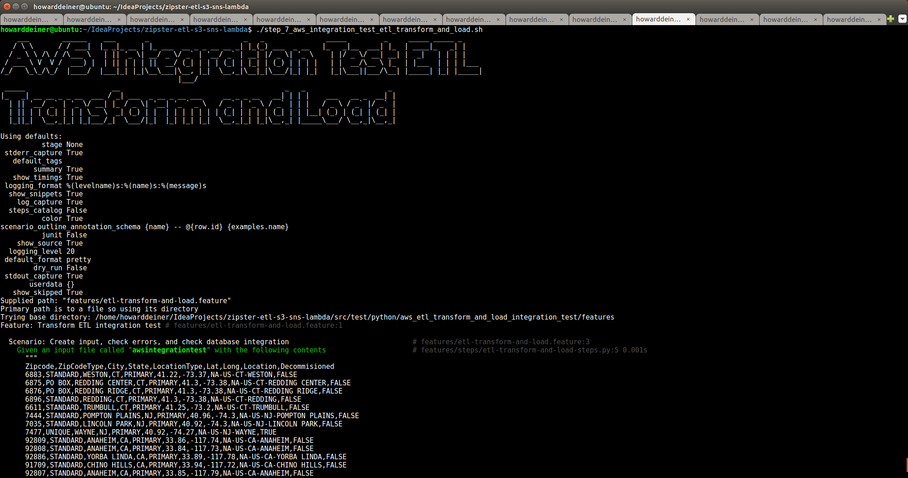
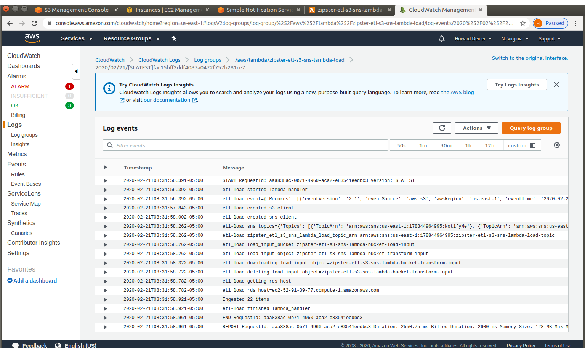
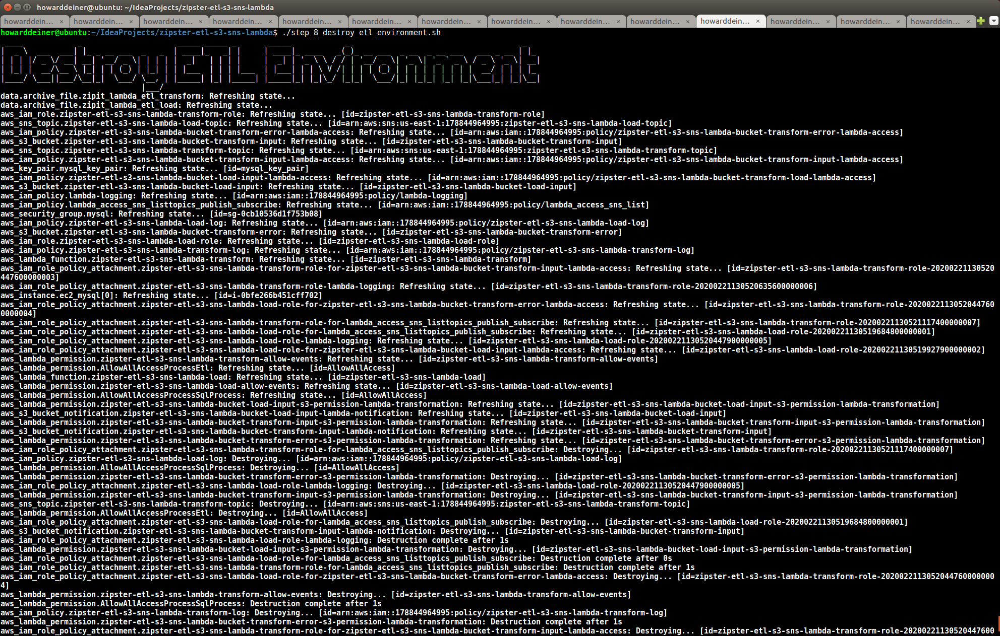

### Rethinking ETL in a Serverless World

##### Concept
Right now, we use expensive tools such as Informatica to do ETL processing and ingestion of data.  Besides cost, there are issues such as lean wastes due to large batch size, quality, difficult testing, and so on.  So, here is an alternative to rethink the problem.  What if we built small serverless lambda functions (such as AWS Lambda), and coupled this with Simple Storage Service (AWS S3) and Simple Notification Service (AWS SNS) to transform and process input into loadable data for backend storage, along with error reporting?  This coukld make use of all of the advantages of Cloud Computing (only pay for what you use), as well as the advantages of Infrastructurre as Code (IaC).  Code could be written in whatever langue we want (I used Python here), tested locally, brought into AWS infrastructure using Terraform (allowing Contunuous Deployment using Git Pull Requests).  By the use of SNS, processing is as easy as creating an object in an designated S3 bucket, and monitoring using things like eMail and SMS integrated.

Here's a system level diagram is what this project looks like:

##### Demo
###### Chapter 1 - Starting backwards: looking at the end-to-end integration test FIRST
There's no quicker way to convey what the entire system is about than to show the steps involved in doing an end-to-end integration test.  
Even better when those steps are automated in tool like Python's behave.  You should get the sense of the steps involved:
- A CSV type of file is put together.
- That file is sent to an AWS S3 bucket.
- Another S3 bucket then contains errors from the transformation.
- Data is loaded into a database when we can then test against.

###### Chapter 2 - The etl_transform program
Notice that this file is very self contained.  We can run it as a main from the command line, put it up on AWS to run as a Lambda Function, and even test the places where we have fear using PyTest.

###### Chapter 3 - Testing the etl_transform locally, both for unit and acceptance tests.
So, let's take a look at the transformation acceptance tests, which only works on the local machine, and see what's tested.  Based on Chapter 1, there should be no surprises.  Then, let's run the unit and acceptance tests.

 
 
 
  

###### Chapter 4 - The etl_load program
This program is both easier and harder than the transform program.  Easier because there is less to go wrong and less to do.  Harder because we have to use the mypysql package and use it with pip installing it, so we can use it on AWS Lambda Functions without too much hassle.

###### Chapter 5 - Testing the etl_load locally, with Docker used for MySQL database 
The first step in testing that we can load ETL data into the MySQL database is to create a MySQL Docker image.  This image starts with the official Dockerfile (modified to allow for the MySQL data to be volume'd into the container).
We then use Flyway to migrate the database schema and the data to a known state (which leaves out the data that we are about to ETL load into the database).
The image is then pushed into DockerHub.
 

 

 

 

 

We now start a MySQL container from the image we just produced.

 

We now need to run the integration test that will run a behave BDD scenario and load the data into the database (the load file was conveniently left over from the etl-transform script run earlier).

 
 

With everything done for our local integration test, we now clean up everything we put in place with Docker.

 

###### Chapter 6 - Revealing the AWS infrastructure
Referrring back to our initial system diagram, we now write the Terraform code for everything.
This brings up some of the interresting aspects of the descriptive form of the Terraform scripts, as it understands how things like an EC2 instance dependency (for MySQL, in this case) requires that the Lambda Function for etl-load be delayed until the end, whereas the Lambda Function for etl-transform has less dependencies, and can therefore complete execution earlier.
If we were to write the iac code in an imterrative language (such as a Python program using boto3 for the AWS API), we would have to understand, implement, and probably debug all of those interdependent requirements ourself.  

First, ensure that we are running with a version of Terraform that supports the notation we have encoded our scripts in.

Now,give Terraform access to our AWS credentials and let it know where we want our infrastructure constructed.

Define the S3 buckets we need and implement the Lambda Function notification of suitable S3 events (such as object created).

Define the notification services for our application.  Notice the tricky way that I added SMTP notifications.
Normally, SNS does not support eMail, but this is one way we can make that happen.

To provide MySQL to the application, an EC2 instance is put together.  One
thing of note here is that inline provisioning is also used, so that the scripts
and data needed to run the Docker Containerized MySQL image can be placed on the
EC2 instance.  The last thing done is to run the provisioning script, which is 
described next.

Here, we merely have to install Docker, docker-compose, and the mysql client.  Then, we start the container
from the DockerHub image we put together (and tested) earlier, and wair for the database to spin up.

This is the most involved Terraform script in this sample.  Thats not because of how difficult describing a Lambda
Function for AWS is.  Rather, the majority of the code is centered around IAM permissions and roles that allow our 
infrastructure to do it's intended functionality.  Also, notice that the very first thing that is done is to create
deployment packages from our source, which is as simple as creating a zip file from the code we wish to run!

###### Chapter 7 - Creating the AWS infrastructure
It's finally time to allow Terraform the chance to do its thing!
 
 
 
 
 
 
 

###### Chapter 9 - SNS subscription verifications
Once Terraform creates the SMTP SNS subscriptions, because they are eMails, AWS reqires that the recipient verifies that they
want to subscribe.  This does not occurr with SMS notifications, and can be avoided if the domain is made veriiable in the AWS system.
But this is what those eMails look like.

 

 

 

 

###### Chapter 10 - Run the integration test on this machine, but utilizing the AWS backend.
The aws_etl_transform_and_load_integration_test is not much different than it's local conterpart.  Except, here, we point to the S3
buckets to create input for transformation, check against the S3 bucket for transformation errors, and run our MySQL tests against 
the DNS endpoint that Terraform created on AWS.

 
 

 
 

 
 
 

###### Chapter 11 - Noting the SNS eMail trail

 

 

 

 

 

 

 

 

###### Chapter 12 - Explore the AWS Console after the fact

What the S3 bucket structure is.
 

What EC2 instances are present.
 

What SNS topics are available.  Ours are the last two. 
 

What Lambda Functions are available.
 

What the etl-transform function looks like.
 

What the etl-load function looks like.
 

What the etl-transform log shows.
 

What the etl-load log shows.
 

###### Chapter 13 - And, finally, destroy the AWS infrastructure

