### Rethinking ETL in a Serverless World

##### Concept
Right now, we use expensive tools such as Informatica to do ETL processing and ingestion of data.  Besides cost, there are issues such as lean wastes due to large batch size, quality, difficult testing, and so on.  So, here is an alternative to rethink the problem.  What if we built small serverless lambda functions (such as AWS Lambda), and coupled this with Simple Storage Service (AWS S3) and Simple Notification Service (AWS SNS) to transform and process input into loadable data for backend storage, along with error reporting?  This coukld make use of all of the advantages of Cloud Computing (only pay for what you use), as well as the advantages of Infrastructurre as Code (IaC).  Code could be written in whatever langue we want (I used Python here), tested locally, brought into AWS infrastructure using Terraform (allowing Contunuous Deployment using Git Pull Requests).  By the use of SNS, processing is as easy as creating an object in an designated S3 bucket, and monitoring using things like eMail and SMS integrated.

Here's a system level diagram is what this project looks like:

##### Demo
###### Chapter 1 - look at our test input

###### Chapter 2 - our etl_transform program

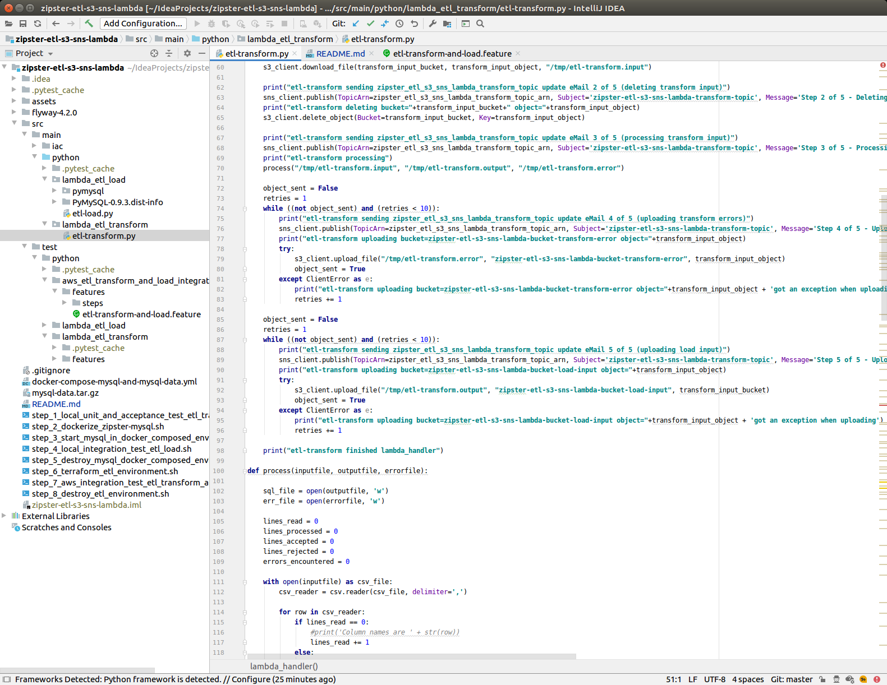

###### Chapter 3 - (manual for now) testing the etl_transform locally 

 

###### Chapter 4 - our etl_load program

###### Chapter 5 - (manual for now) testing the etl_load locally (Docker used for MySQL database) 

Building the MySQL image (with local storage) in a version controlled way (all DDL and static data to a particular version created)

 

 

 

 

 

Start MySQL container from the image we just produced

 

Run etl_load

 

Cleanup local MySQL test environment

 

###### Chapter 6 - revealing the AWS infrastructure

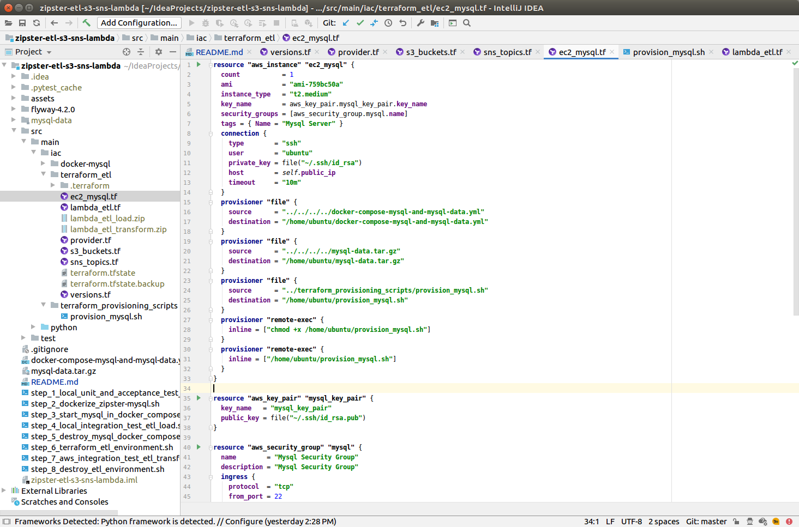

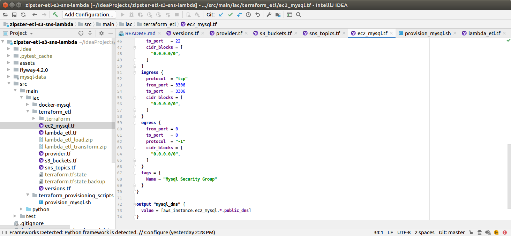

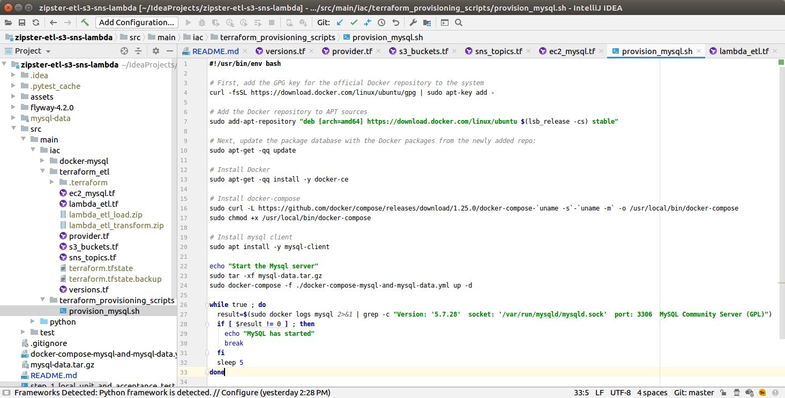

###### Chapter 8 - creating the AWS infrastructure

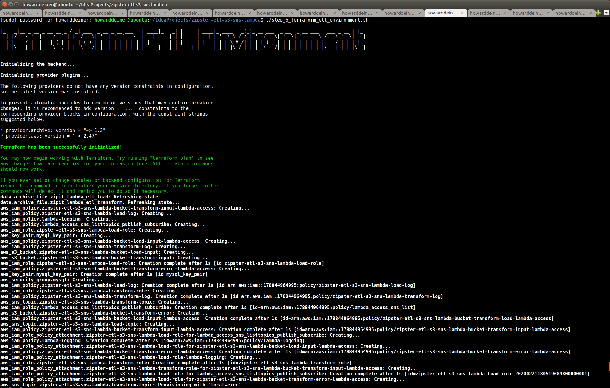 

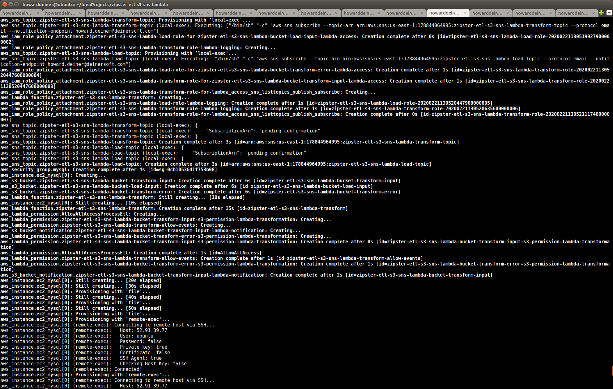 

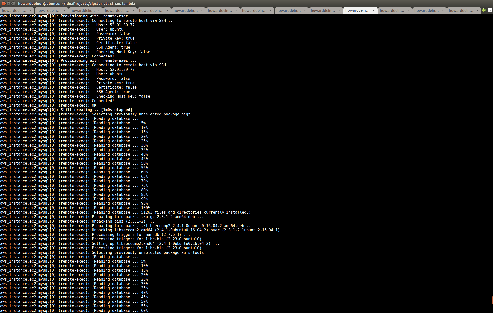 

 

 

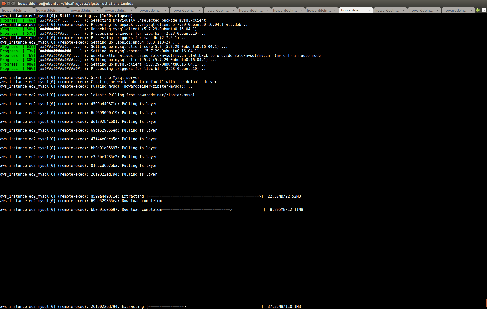 

 

  

###### Chapter 11 - SNS subscription verifications

 

 

 

 

###### Chapter 10 - kick off an etl

 

###### Chapter 10 - verify on AWS Console and eMails

 

 

 

 

 

 

 

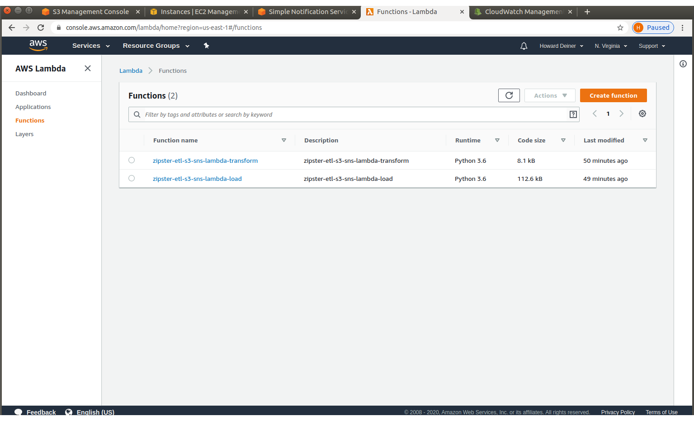 

 

 

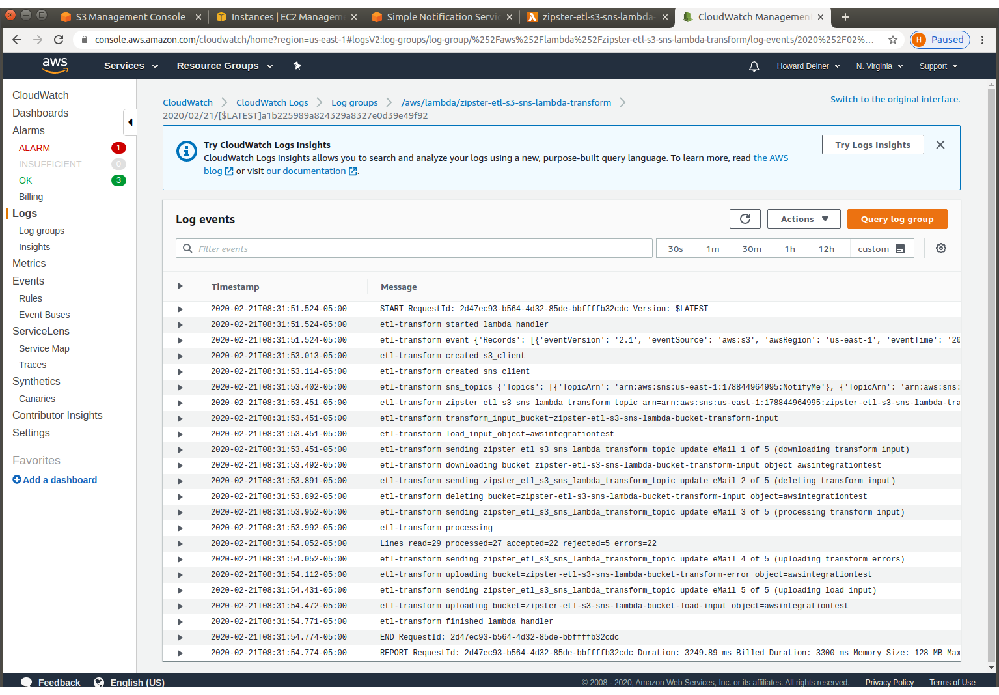 

 

 

###### Chapter 11 - destroy the AWS infrastructure

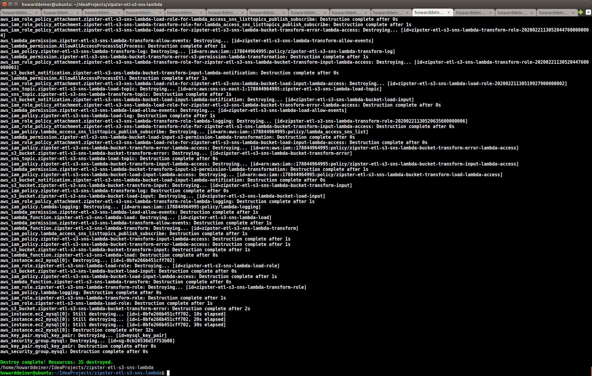

